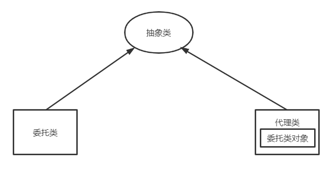
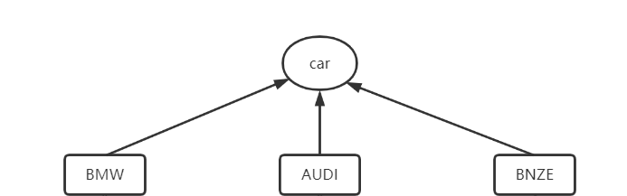
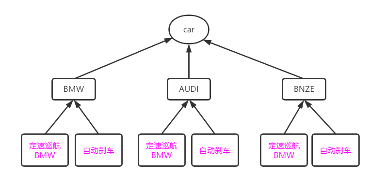
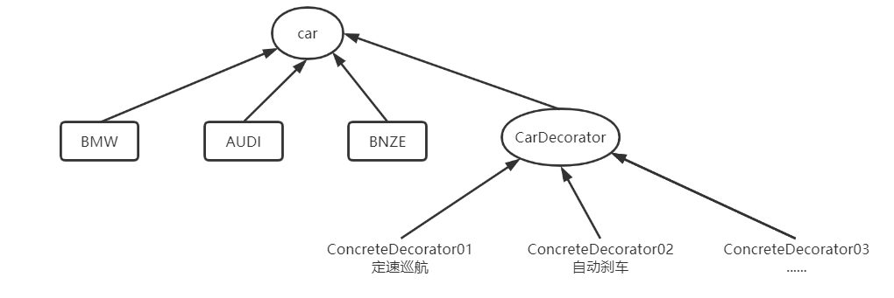

### Design Patterns

#### 一、创建型模式

1.工厂方法
2.抽象工厂

#### 二、结构型模式

> 这些设计模式关注类和对象的组合。
> 继承的概念被用来组合接口和定义组合对象获得新功能的方式

1.代理模式 proxy pattern

2.装饰器模式

> 为了增强现有类的功能，通过实现子类的方式，重写接口，是可以完成功能扩展的，但是代码中有太多的子类添加进来了。如下图

> 通过装饰器来实现

#### 三、行为型模式

